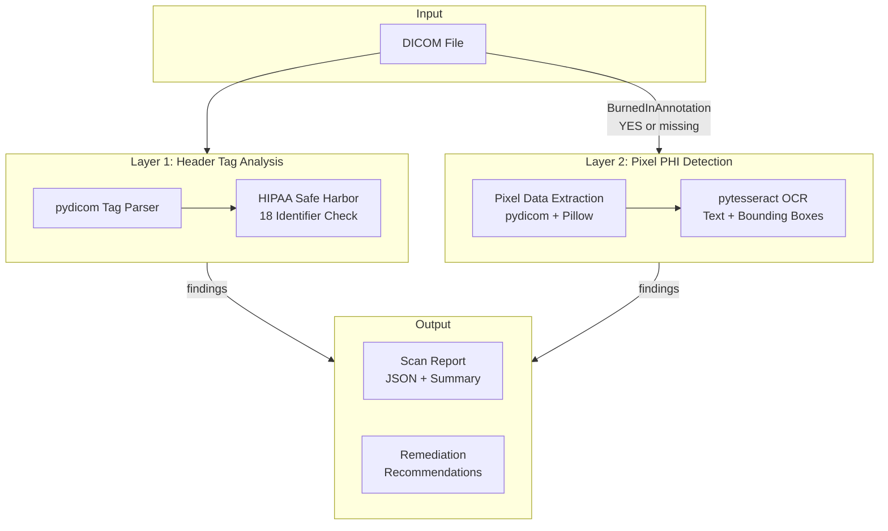

# DICOM PHI Scanner

Two-layer pipeline for detecting Protected Health Information (PHI) in DICOM medical imaging files. Scans both header tags and burned-in pixel text to identify PHI that must be removed before data sharing.

Built for healthcare data engineers who need to verify DICOM de-identification before inter-institutional data sharing or research use.

## Architecture



## How It Works

### Layer 1 — Header Tag Analysis (`src/tag_scanner.py`)
Parses DICOM metadata tags against the HIPAA Safe Harbor de-identification standard. Checks ~50 tags across categories:
- **Direct identifiers** (HIGH): Patient name, ID, birth date, address, phone
- **Institutional** (HIGH): Institution name/address, physician names, accession numbers
- **Temporal** (MEDIUM): Study/series dates and times
- **Device** (MEDIUM): Station name, device serial number
- **UIDs** (MEDIUM): Study/Series/SOP Instance UIDs

Common de-identification placeholders (ANONYMOUS, REDACTED, etc.) are filtered out to reduce false positives.

### Layer 2 — Pixel PHI Detection (`src/pixel_scanner.py`)
Detects PHI burned into pixel data (common in ultrasound, CR, secondary capture):
1. Extracts pixel data to image via `pydicom` + `Pillow`
2. Runs `pytesseract` OCR to extract text with bounding box coordinates and confidence scores
3. All detected text above the confidence threshold is flagged as potential PHI

### Scanning Pipeline (`src/scanner.py`)
1. Runs header tag scan
2. Checks `BurnedInAnnotation (0028,0301)` — if YES or missing, triggers pixel scan
3. Aggregates findings, computes overall risk level (HIGH / MEDIUM / LOW), and generates remediation recommendations

## Requirements

- Python 3.10+
- [Tesseract OCR](https://github.com/tesseract-ocr/tesseract) installed and on PATH

## Quick Start

```bash
# Install
pip install -e .

# Create test fixtures (synthetic data only)
python fixtures/create_test_fixtures.py

# Scan a single file
dicom-phi-scan fixtures/test_phi_header.dcm

# JSON output
dicom-phi-scan fixtures/test_phi_header.dcm --output json

# Batch scan a directory
dicom-phi-scan --dir fixtures/

# Verbose logging
dicom-phi-scan fixtures/test_phi_header.dcm -v

# Run the REST API
uvicorn src.api:app --reload
```

## REST API

```bash
uvicorn src.api:app --reload
```

| Endpoint | Method | Description |
|----------|--------|-------------|
| `/scan` | POST | Upload a `.dcm` file, returns a `ScanReport` JSON |
| `/health` | GET | Health check |

```bash
curl -X POST http://localhost:8000/scan \
  -F "file=@fixtures/test_phi_header.dcm"
```

## Python API

```python
from src.scanner import scan_file

report = scan_file("path/to/file.dcm")
print(report.risk_level)       # Severity.HIGH / MEDIUM / LOW
print(report.total_phi_count)  # number of findings
print(report.recommendations)  # list of action items
```

## Project Structure

```
src/
├── api.py             # FastAPI endpoints (POST /scan, GET /health)
├── cli.py             # CLI entry point (dicom-phi-scan)
├── models.py          # Pydantic models (ScanReport, PHITagFinding, PixelPHIFinding, BatchReport)
├── pixel_scanner.py   # Layer 2: OCR pixel text detection
├── scanner.py         # Orchestration pipeline
└── tag_scanner.py     # Layer 1: DICOM header tag analysis
tests/
├── test_api.py
├── test_pixel_scanner.py
├── test_scanner.py
└── test_tag_scanner.py
fixtures/
└── create_test_fixtures.py  # Generate synthetic test DICOMs
```

## Test Data

All test fixtures use **entirely synthetic/fake data**. No real patient information is included anywhere in this repository.

- `test_phi_header.dcm` — Fake PHI in header tags (name, MRN, DOB, institution)
- `test_phi_pixel.dcm` — Fake PHI burned into pixel data (name, MRN, DOB overlaid on image)
- `test_clean.dcm` — Properly de-identified file (negative test case)

## Development

```bash
pip install -e ".[dev]"

# Run tests
pytest

# Lint
ruff check .
```

## Design Decisions

- **Two-layer approach**: Header-only scanning misses burned-in annotations, which are common in ultrasound, CR, and secondary capture DICOM objects. Pixel analysis catches what tag scanning cannot.
- **Flag all OCR text as PHI**: Rather than attempting to classify burned-in text (which risks false negatives), all OCR-detected text is flagged as potential PHI. This conservative approach prioritizes patient privacy.
- **BurnedInAnnotation tag is checked but not trusted**: This tag is frequently missing or incorrectly set in real-world DICOM data. Pixel analysis still runs when the tag is absent.
- **Synthetic test data**: Real DICOM datasets from TCIA are already de-identified and don't exercise the PHI detection path. Synthetic fixtures with planted fake PHI give controlled, repeatable test cases.

## Stack

Python · pydicom · Pillow · pytesseract · Pydantic · FastAPI

## License

MIT
