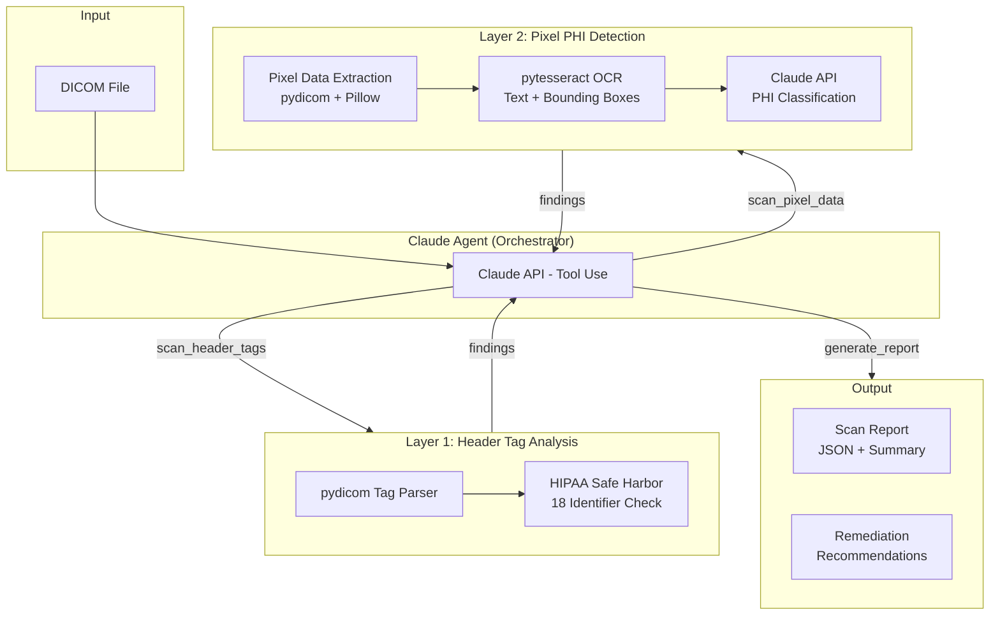

# DICOM PHI Screening Agent

An agentic pipeline that scans DICOM medical imaging datasets for Protected Health Information (PHI) using header tag analysis, OCR-based pixel inspection, and Claude AI classification.

Built for healthcare data engineers who need to verify DICOM de-identification before inter-institutional data sharing or research use.

## Architecture



## How It Works

### Layer 1 — Header Tag Analysis
Parses DICOM metadata tags against the HIPAA Safe Harbor de-identification standard. Checks ~50 tags across categories:
- **Direct identifiers** (HIGH): Patient name, ID, birth date, address, phone
- **Institutional** (HIGH): Institution name/address, physician names, accession numbers
- **Temporal** (MEDIUM): Study/series dates and times
- **Device** (MEDIUM): Station name, device serial number
- **UIDs** (MEDIUM): Study/Series/SOP Instance UIDs

### Layer 2 — Pixel PHI Detection
Detects PHI burned into pixel data (common in ultrasound, CR, secondary capture):
1. Extracts pixel data to image via `pydicom` + `Pillow`
2. Runs `pytesseract` OCR to extract text with bounding box coordinates
3. Sends text to Claude API for classification — distinguishes PHI (names, dates, MRNs) from safe annotations (laterality markers, technical parameters)

### Agent Orchestration
Claude acts as the orchestrator via tool use:
1. Runs header tag scan first
2. Checks `BurnedInAnnotation (0028,0301)` — if YES or missing, triggers pixel scan
3. Aggregates all findings into a structured report with remediation recommendations

## Quick Start

```bash
# Install
pip install -e .

# Set API key
export ANTHROPIC_API_KEY=your-key-here

# Create test fixtures (synthetic data only)
python fixtures/create_test_fixtures.py

# Scan a DICOM file (agent mode)
dicom-phi-scan fixtures/test_phi_header.dcm

# Scan with JSON output
dicom-phi-scan fixtures/test_phi_pixel.dcm --output json

# Direct mode (no agent orchestration)
dicom-phi-scan fixtures/test_phi_header.dcm --mode direct

# Run the API server
uvicorn src.api:app --reload
```

## API Usage

```bash
# Upload and scan via API
curl -X POST http://localhost:8000/scan \
  -F "file=@fixtures/test_phi_header.dcm"
```

## Test Data

All test fixtures use **entirely synthetic/fake data**. No real patient information is included anywhere in this repository.

- `test_phi_header.dcm` — Fake PHI in header tags (name, MRN, DOB, institution)
- `test_phi_pixel.dcm` — Fake PHI burned into pixel data (name, MRN, DOB overlaid on image)
- `test_clean.dcm` — Properly de-identified file (negative test case)

## Running Tests

```bash
pip install -e ".[dev]"
pytest
```

## Design Decisions

- **Two-layer approach**: Header-only scanning misses burned-in annotations, which are common in ultrasound, CR, and secondary capture DICOM objects. Pixel analysis catches what tag scanning cannot.
- **Claude for classification, not rule-based regex**: Medical images contain many text annotations (laterality markers, kV/mA values, slice info) that are NOT PHI. Claude's contextual understanding produces far fewer false positives than pattern matching.
- **BurnedInAnnotation tag is checked but not trusted**: This tag is frequently missing or incorrectly set in real-world DICOM data. The agent still runs pixel analysis when the tag is absent.
- **Synthetic test data**: Real DICOM datasets from TCIA are already de-identified and don't exercise the PHI detection path. Synthetic fixtures with planted fake PHI give controlled, repeatable test cases.

## Stack

Python · pydicom · Pillow · pytesseract · Claude API · Pydantic · FastAPI

## License

MIT
